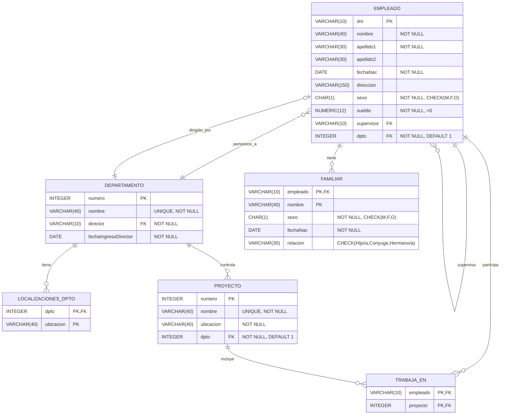

# BD Empresa

## Esquema

### Modelo relacional

>[!error] Pendiente
>Falta definir las claves alternativas

- $EMPLEADO$(nombre, apellido1, apellido2, <u>dni</u>, fechaNac, dirección, sexo, sueldo, supervisor, dpto )
	- Representa una entidad del mundo real
	- Clave primaria (PK): `{dni}`
	- Claves externas (FK): 
		- `{supervisor}` referencia al atributo `dni` de la misma relación. Indica quién es el supervisor de un determinado empleado
		- `{dpto}` referencia al atributo `numeroDpto` de la relación $DEPARTAMENTO$. Indica a qué departamento pertenece un empleado

>[!question] 
>¿Puede un empleado no tener supervisor?

- $DEPARTAMENTO$(nombre, <u>numero</u>, director, fechaIngresoDirector)
	- Representa una entidad del mundo real
	- Clave primaria (PK): `{numero}`
	- Claves externas (FK): 
		- `{director}` referencia al atributo `dni` de la relación $EMPLEADO$. Indica quién es el director de un determinado departamento
		
>[!question] 
>¿Cuántos directores puede tener un departamento?

- $LOCALIZACIONES_DPTO$(<u>dpto</u>, ubicacion)
	- Representa una entidad del mundo real
	- Clave primaria (PK): `{dpto}`
	- Claves externas (FK): 
		- `{dpto}` referencia al atributo `numero` de la relación $DEPARTAMENTO$. Indica la localización de un departamento
		
- $PROYECTO$(nombre, <u>numero</u>, ubicacion, dpto)
	- Representa una entidad del mundo real
	- Clave primaria (PK): `{numero}`
	- Claves externas (FK): 
		- `{dpto}` referencia al atributo `numero` de la relación  $DEPARTAMENTO$. Indica a qué departamento está asignado el proyecto.

- $TRABAJA\_EN$(<u>empleado, proyecto</u>, horas)
	- Representa una asociación (relación) entre entidades del mundo real
	- Clave primaria (PK): `{empleado, proyecto}`
	- Claves externas (FK): 
		- `{empleado}` referencia al atributo `dni` de la relación $EMPLEADO$. Indica el empleado que trabaja en un proyecto
		- `{proyecto}` referencia al atributo `numero` de la relación $PROYECTO$. Indica el proyecto en el que trabaja un empleado

>[!question] 
>¿En cuántos proyectos puede trabajar un empleado?

- $FAMILIAR$(<u>empleado, nombre</u>, sexo, fechaNac, relación)
	- Representa una entidad del mundo real
	- Clave primaria (PK): `{empleado , nombre}`
	- Claves externas (FK): 
		- `{empleado}` referencia al atributo `dni` de la relación $EMPLEADO$. Indica el empleado del que es pariente

>[!question] 
>¿Cuántos familiares puede tener un empleado?


### Diagrama



### SQL 

#### SQL estándar

```sql

-- EMPLEADO(nombre, apellido1, apellido2, dni, fechaNac, dirección, sexo, sueldo, superDni, numeroDpto )

CREATE TABLE EMPLEADO (	
	nombre VARCHAR(40) NOT NULL,
	apellido1 VARCHAR(30) NOT NULL,
	apellido2 VARCHAR(30),
	dni VARCHAR(10) NOT NULL,
	fechaNac DATE NOT NULL,
	direccion VARCHAR(150),
	sexo CHAR(1) NOT NULL CHECK (sexo IN ('M', 'F', 'O')),
	sueldo NUMERIC(12,2) NOT NULL CHECK (sueldo > 0),
	supervisor VARCHAR(10),
	dpto INTEGER DEFAULT 1 NOT NULL,  -- DEPARTAMENTO[1..1] -> EMPLEADO[0..N]
	PRIMARY KEY (dni),
	FOREIGN KEY (supervisor) REFERENCES EMPLEADO (dni) ON UPDATE CASCADE ON DELETE SET NULL,
	FOREIGN KEY (dpto) REFERENCES DEPARTAMENTO (numero) ON UPDATE CASCADE ON DELETE SET DEFAULT
);

-- DEPARTAMENTO(nombre, numero, director, fechaIngresoDirector)

CREATE TABLE DEPARTAMENTO (
	nombre VARCHAR(40) UNIQUE NOT NULL,
	numero INTEGER NOT NULL,
	director TEXT UNIQUE NOT NULL,      -- EMPLEADO[1..1] -> DEPARTAMENTO[0..1] 
	fechaIngresoDirector DATE NOT NULL,
	PRIMARY KEY (numero),
	FOREIGN KEY (director) REFERENCES EMPLEADO(dni) ON UPDATE CASCADE ON DELETE RESTRICT
);

-- LOCALIZACIONES_DPTO(dpto, ubicacion)

CREATE TABLE LOCALIZACIONES_DPTO (
	dpto INTEGER NOT NULL,
	ubicacion VARCHAR(40) NOT NULL,
	PRIMARY KEY (dpto, ubicacion),
	FOREIGN KEY (dpto) REFERENCES DEPARTAMENTO(numero) ON UPDATE CASCADE ON DELETE CASCADE
);	

-- PROYECTO(nombre, numero, ubicacion, dpto)

CREATE TABLE PROYECTO (
	nombre VARCHAR(40) UNIQUE NOT NULL,
	numero INTEGER NOT NULL,
	ubicacion VARCHAR(40) NOT NULL,
	dpto INTEGER, -- DEPARTAMENTO[1..1] -> PROYECTO[0..N]
	PRIMARY KEY (numero),
	FOREIGN KEY (dpto) REFERENCES DEPARTAMENTO(numero) ON UPDATE CASCADE ON DELETE SET DEFAULT
);

-- TRABAJA\_EN(empleado, proyecto, horas)
CREATE TABLE TRABAJA_EN(	
	empleado VARCHAR(10) NOT NULL,
	proyecto INTEGER NOT NULL,
	horas REAL CHECK (horas > 0),
	PRIMARY KEY (empleado,proyecto),
	FOREIGN KEY (empleado) REFERENCES EMPLEADO(dni) ON UPDATE CASCADE ON DELETE CASCADE
	FOREIGN KEY (proyecto) REFERENCES PROYECTO(numero) ON UPDATE CASCADE ON DELETE CASCADE
);
-- FAMILIAR(empleado, nombre, sexo, fechaNac, relación)

CREATE TABLE FAMILIAR (	
	empleado VARCHAR(10) NOT NULL,
	nombre VARCHAR(100) NOT NULL,
	sexo CHAR(1) NOT NULL CHECK (sexo IN ('M', 'F', 'O')),
	fechaNac DATE NOT NULL,
	relacion VARCHAR(30) CHECK (relacion IN ('Hijo','Hija','Conyuge','Hermano', 'Hermana')),	
	PRIMARY KEY (empleado,nombre),
	FOREIGN KEY (empleado) REFERENCES EMPLEADO(dni) ON UPDATE CASCADE ON DELETE CASCADE
);

```
