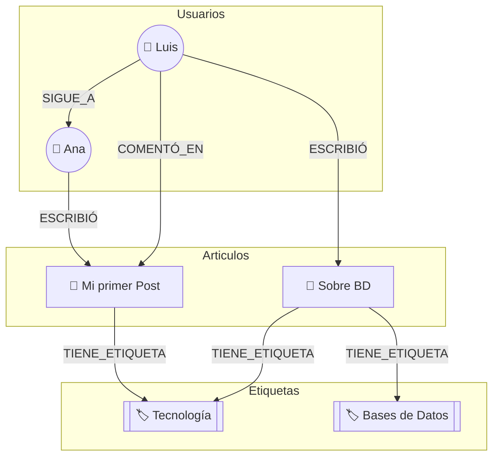

# El Escenario: Una Sencilla Red Social de Blogs 📝
(generado con Gemini 2.5 Pro)

Imaginemos que queremos construir una plataforma simple donde los **usuarios** pueden:

1. Escribir **artículos**.
2. Añadir **etiquetas** (tags) a sus artículos (ej: "Tecnología", "Bases de Datos").
3. Escribir **comentarios** en los artículos.
4. **Seguir** a otros usuarios para ver sus publicaciones.

Este escenario tiene entidades (usuarios, artículos) y relaciones de distinta naturaleza (un artículo tiene comentarios, un usuario sigue a otro), que nos permite ilustrar las fortalezas de cada modelo.

---

### 1. Modelo Relacional (SQL) 🗄️

Este es el modelo clásico, basado en tablas estructuradas con filas y columnas. Piensa en ello como una colección de hojas de cálculo muy bien organizadas y conectadas entre sí.

- **Idea Principal:** Separar cada entidad en su propia tabla y conectar las tablas mediante identificadores (claves foráneas/externas). La prioridad es la **consistencia** de los datos y evitar la duplicidad (normalización).
    
#### Modelado del Ejemplo:

Necesitaríamos varias tablas:

**Tabla Usuarios**

| id_usuario (PK) | nombre | email          | fecha_registro |
| --------------- | ------ | -------------- | -------------- |
| 1               | Ana    | ana@email.com  | 2023-10-26     |
| 2               | Luis   | luis@email.com | 2023-10-27     |

**Tabla Articulos:**

| id_articulo (PK) | titulo           | contenido               | fecha      | id_autor (FK -> Usuarios) |
| ---------------- | ---------------- | ----------------------- | ---------- | ------------------------- |
| 101              | "Mi primer Post" | "Hola mundo..."         | 2023-11-01 | 1                         |
| 102              | "Sobre BD"       | "Las bases de datos..." | 2023-11-02 | 2                         |
  
**Tabla Comentarios:**

| id_comentario (PK) | texto             | fecha      | id_autor (FK -> Usuarios) | id_articulo (FK -> Articulos) |
| ------------------ | ----------------- | ---------- | ------------------------- | ----------------------------- |
| 5001               | "¡Gran artículo!" | 2023-11-01 | 2                         | 101                           |

Para las etiquetas (una relación de muchos a muchos, ya que un artículo puede tener varias etiquetas y una etiqueta puede estar en varios artículos), necesitamos una tabla intermedia:

**Tabla Etiquetas:**
  
| id_etiqueta (PK) | nombre_etiqueta  |
| ---------------- | ---------------- |
| 1                | "Tecnología"     |
| 2                | "Bases de Datos" |

**Tabla Articulo_Etiqueta (Tabla de Unión):**
  
| id_articulo (FK) | id_etiqueta (FK) |
| ---------------- | ---------------- |
| 101              | 1                |
| 102              | 1                |
| 102              | 2                |
  
**¿Cuándo es ideal?** Cuando la estructura de los datos es predecible y la consistencia es crítica (sistemas bancarios, inventarios, ERPs). Su lenguaje de consulta (SQL) es extremadamente potente para consultas complejas.

---

### 2. Modelo Orientado a Documentos (NoSQL) 📄

Este modelo no usa tablas, sino "documentos" (normalmente en formato JSON), que son como fichas o expedientes autocontenidos.

- **Idea Principal:** Agrupar toda la información relacionada en un único documento. La prioridad es la **flexibilidad** y la **velocidad de lectura**, ya que no necesitas unir distintas tablas para obtener la información de, por ejemplo, un artículo y sus comentarios.
    
- Modelado del Ejemplo:
    
    Nos centraríamos en el Articulo como el documento principal. En lugar de tener una tabla de comentarios separada, los comentarios se "incrustan" dentro del propio documento del artículo.
    
    Tendríamos una colección de `Articulos`, donde cada documento se vería así:
            
    ```json
    {
      "_id": 101,
      "titulo": "Mi primer Post",
      "contenido": "Hola mundo...",
      "fecha": "2023-11-01",
      "autor": {
        "id_usuario": 1,
        "nombre": "Ana"
      },
      "etiquetas": ["Tecnología", "Introducción"],
      "comentarios": [
        {
          "id_comentario": 5001,
          "texto": "¡Gran artículo!",
          "fecha": "2023-11-01",
          "autor_comentario": {
            "id_usuario": 2,
            "nombre": "Luis"
          }
        },
        {
          "id_comentario": 5002,
          "texto": "Muy útil, gracias.",
          "fecha": "2023-11-02",
          "autor_comentario": {
            "id_usuario": 3,
            "nombre": "Carla"
          }
        }
      ]
    }
    ```
    
- **¿Cuándo es ideal?** Para sistemas de gestión de contenidos, catálogos de productos, perfiles de usuario. Es muy fácil de escalar y evolucionar, ya que no todos los documentos necesitan tener la misma estructura.
    

---

### 3. Modelo Basado en Grafo (NoSQL) 🌐

Este modelo se centra en las **relaciones**. Los datos se representan como nodos (las entidades) y aristas (las relaciones entre esas entidades). Es como un mapa conceptual o una red social.

- **Idea Principal:** Tratar las relaciones como ciudadanos de primera clase. Es perfecto para explorar conexiones complejas y profundas entre los datos.
    
- Modelado del Ejemplo:
    
    Definiríamos nuestros elementos como nodos y las acciones como aristas con nombre:
    
    - **Nodos:**
        
        - `Usuario` (con propiedades como `nombre: "Ana"`)
            
        - `Articulo` (con propiedades como `titulo: "Mi primer Post"`)
            
        - `Etiqueta` (con propiedades como `nombre: "Tecnología"`)
            
    - **Aristas (Relaciones):**
        
        - Ana **`ESCRIBIÓ`** el artículo "Mi primer Post".
            
        - Luis **`COMENTÓ`** en el artículo "Mi primer Post".
            
        - El artículo "Mi primer Post" **`TIENE_ETIQUETA`** "Tecnología".
            
        - Ana **`SIGUE_A`** Luis. 
            
    
    Una consulta típica sería: "Muéstrame los artículos escritos por personas que yo sigo y que estén etiquetados como 'Tecnología'". En un grafo, esta consulta es increíblemente rápida y natural.



- **¿Cuándo es ideal?** Para redes sociales (LinkedIn, Facebook), sistemas de recomendación ("usuarios que compraron esto también compraron..."), detección de fraudes y cualquier problema donde el "quién está conectado con quién" es la pregunta principal.
    

---

### 4. Modelo de Columna Grande / Familiar (NoSQL) 🏛️

Imagina una tabla con miles de millones de filas y potencialmente millones de columnas, pero de forma muy eficiente porque no se guardan los espacios vacíos (nulos).

- **Idea Principal:** Organizar los datos en familias de columnas. Cada fila tiene una clave única, y puedes agrupar columnas relacionadas en "familias". Es ideal para cantidades masivas de datos (Big Data) con un patrón de escritura muy intenso.
    
- Modelado del Ejemplo:
    
    Podríamos usarlo para registrar la actividad de un usuario. La clave de la fila (Row Key) sería el id_usuario.
    
    **Tabla `Actividad_Usuarios`**:
    
    |Row Key (id_usuario)|Familia: `perfil`|Familia: `articulos_publicados`|Familia: `comentarios_hechos`|
    |---|---|---|---|
    |**1 (Ana)**|`nombre: "Ana"`<br>`email: "ana@email.com"`|`2023-11-01:"101"`|`(ninguno)`|
    |**2 (Luis)**|`nombre: "Luis"`<br>`email: "luis@email.com"`|`2023-11-02:"102"`|`2023-11-01:"5001"`|
    
    - La clave de fila es `id_usuario`.
        
    - La familia `perfil` almacena datos básicos del usuario.
        
    - La familia `articulos_publicados` usa como nombre de columna la fecha/hora de publicación y como valor el `id_articulo`. Esto permite ordenar cronológicamente la actividad de forma natural.
        
    - Lo mismo para `comentarios_hechos`.
        
- **¿Cuándo es ideal?** Para sistemas de analítica, telemetría, logs de eventos, datos de series temporales (IoT), o cualquier aplicación que necesite escribir enormes volúmenes de datos a alta velocidad y luego leerlos por rangos (ej: "dame toda la actividad del usuario 2 en la última semana").
    