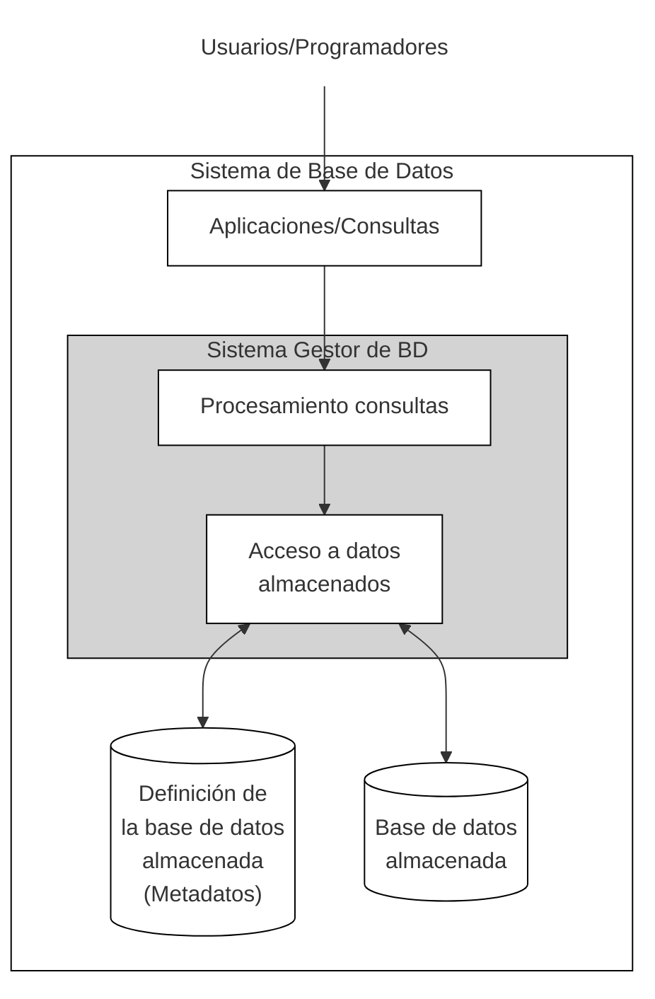
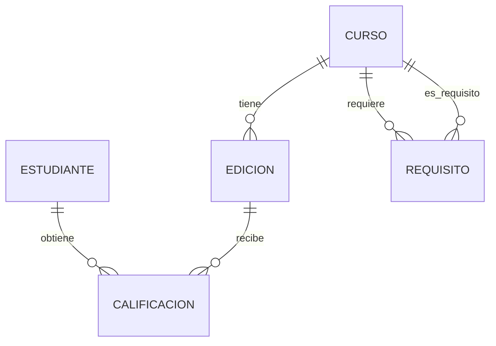
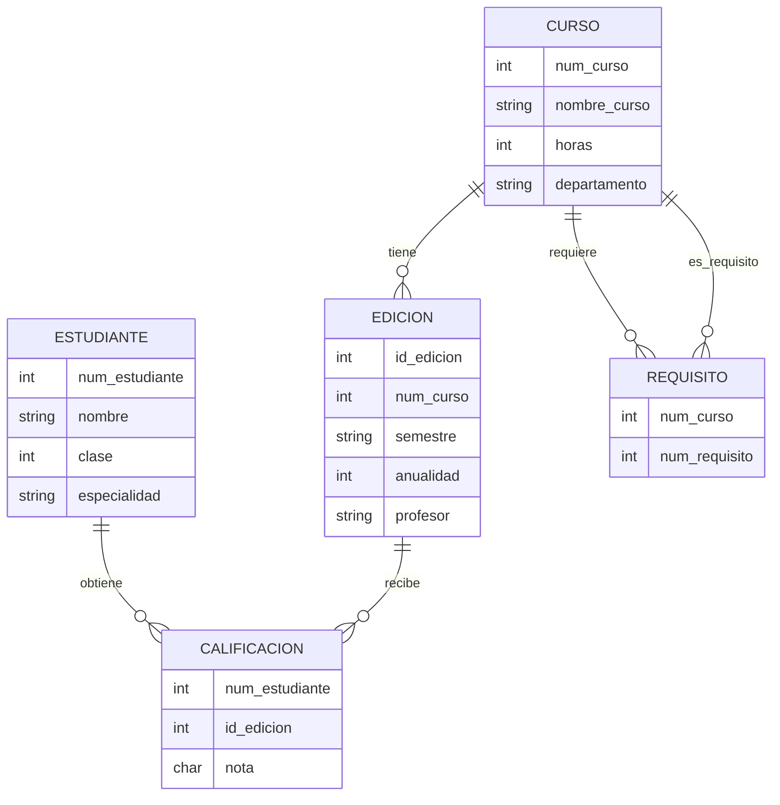
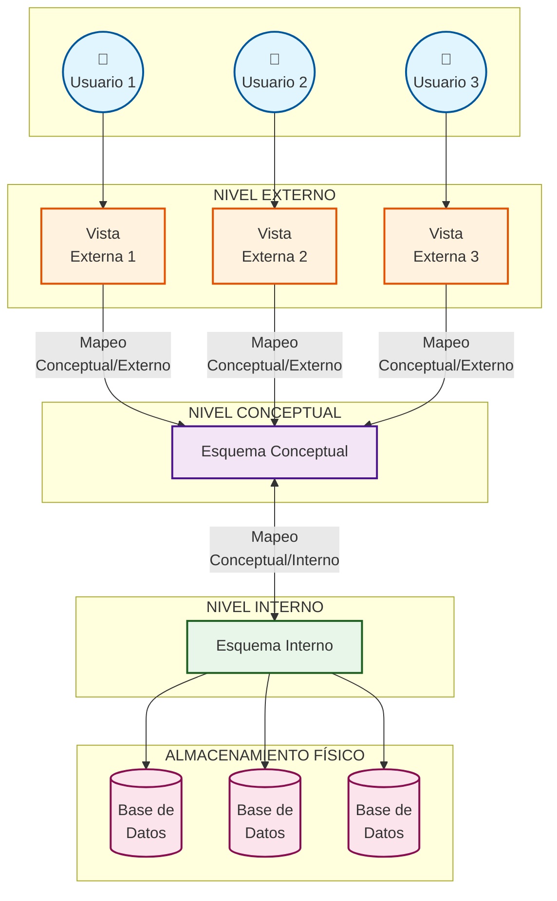

# Tema 01 - Introducción y Conceptos Fundamentales

## Contenidos

1. Introducción
2. Modelos de datos
3. Base de datos
4. Sistemas gestores de bases de datos (SGBD)
5. Usuarios de bases de datos
6. Ventajas de utilizar el enfoque de base de datos
7. Cuándo no utilizar bases de datos

## 1. Introducción

Hoy en día, las bases de datos son esenciales para cualquier negocio. Todas las grandes empresas con presencia en internet (Google, Instagram, Amazon.com o miles de sitios más pequeños que ofrecen información) tienen una base de datos subyacente que proporciona la información que solicita el usuario. **Las empresas mantienen todos sus registros importantes en bases de datos**. 

Asimismo, las bases de datos son **fundamentales para muchas investigaciones científicas**. Representan los datos recopilados por astrónomos, investigadores del genoma humano y bioquímicos que exploran las propiedades de las proteínas, entre muchas otras actividades científicas.

El poder de las bases de datos proviene de un conjunto de **conocimientos y tecnología que se ha desarrollado a lo largo de varias décadas y se materializa** en un software especializado llamado **sistema gestor de bases de datos o SGBD**. Un SGBD es una herramienta poderosa para crear y gestionar grandes cantidades de datos de forma eficiente, permitiendo conservarlos durante largos periodos de tiempo de forma segura. Estos sistemas se encuentran entre los tipos de software más complejos disponibles.

En la siguiente imagen se muestra una línea de tiempo con parte de la [[Historia Bases de Datos]], que sirve como resumen breve de la misma.

###  1.1. Definiciones básicas

- **Datos**: Hechos conocidos que pueden registrarse y tienen un significado implícito.
- **Base de datos**: Una colección de datos relacionados.
- **Mini-mundo**: Parte del mundo real sobre la que se almacenan datos en una base de datos. Por ejemplo, las calificaciones y los expedientes académicos de los estudiantes de una universidad.
- **Sistema gestor de bases de datos (SGBD/DBMS)**: Un paquete de software para facilitar la creación y el mantenimiento de una base de datos computarizada.
- **Sistema de base de datos**: El software SGBD junto con los datos en sí (base de datos). En ocasiones, también se incluyen las aplicaciones.

>[!exercise]+ Ejercicio
> Piensa en qué datos se necesitan guardar para una entidad Persona en los siguientes mini-mundos:
>  - Un banco, representando esta entidad al cliente
>  - Una red social, representando esta entidad al usuario
>  - Un hospital, representando esta entidad al paciente

## 2. Modelos de datos

### 2.1. Definición
El término modelo de datos se refiere a la **forma fundamental en que se organizan, documentan y definen los datos** dentro de un sistema de bases de datos. Sirve como un plano que describe los elementos utilizados para estandarizar el sistema, abarcando aspectos como las asociaciones entre los elementos de datos, las entidades representadas y los requisitos inherentes de los datos.

En esencia, un modelo de datos proporciona un diagrama simplificado o una **representación visual de los elementos de datos** que contiene un SDB. Este marco conceptual no es meramente descriptivo; regula activamente cómo estos elementos de datos se interrelacionan entre sí y cómo se corresponden con las propiedades de las entidades del mundo real.

Un **modelo de datos** es una notación para describir datos o información. La descripción generalmente consta de tres partes:

1. **Estructura de los datos**. Es posible que estés familiarizado con herramientas en lenguajes de programación como C o Java para describir la estructura de los datos utilizados por un programa: arrays y estructuras u objetos, por ejemplo. En el mundo de las bases de datos, hacen referencia a las **construcciones** que se utilizan para **definir** la estructura o **esquema de la base de datos**. Estas construcciones normalmente incluyen **elementos y sus tipos de datos**, así como **grupos** de elementos (por ejemplo , entidad, registro, tabla) y **relaciones** entre dichos grupos.
2. **Operaciones sobre los datos**. En los lenguajes de programación, las operaciones sobre los datos son generalmente cualquier cosa que se pueda programar. En los modelos de datos de bases de datos, usualmente hay un **conjunto limitado de operaciones** que se pueden realizar. Generalmente se nos permite realizar un conjunto limitado de _consultas_,operaciones que recuperan información, y _modificaciones_, operaciones que cambian la base de datos. Esta limitación no es una debilidad, sino una **fortaleza**. Al limitar las operaciones, es posible que los **programadores describan las operaciones de la base de datos a un nivel muy alto**, y aun así hacer que el **sistema de gestión de bases de datos implemente las operaciones de manera eficiente**. En comparación, generalmente es mucho más difícil optimizar programas en lenguajes convencionales como C de forma automática.
3. **Restricciones sobre los datos**. Los modelos de datos de bases de datos usualmente tienen una forma de describir **limitaciones sobre los datos considerados válidos**. Estas restricciones pueden ir desde simples condiciones, por ejemplo, "un día de la semana es un entero entre 1 y 7" o "una película tiene como máximo un título", hasta algunas limitaciones muy complejas. Estas restricciones **deben aplicarse en todo momento** para asegurar la **integridad de la base de datos**: no contiene datos inválidos.

### 2.2. Evolución de los modelos de datos

La práctica del modelado de datos, en sentido amplio, ha sido parte integral del procesamiento, el almacenamiento y la programación informática desde la existencia de estos campos. Sin embargo, el término modelo de datos probablemente **adquirió popularidad en torno a la época en que los sistemas de gestión de bases de datos (SGBD) comenzaron a evolucionar en la década de 1960**. Los primeros sistemas de bases de datos, como los basados ​​en el **modelo jerárquico** de datos, representaron los primeros enfoques basados ​​en SGBD para la organización de datos.

A lo largo de las décadas, el panorama de los modelos de datos ha experimentado una **evolución significativa**. El **modelo relacional**, introducido en la década de **1970**, se convirtió en el **paradigma dominante durante varias décadas** y sigue siendo el más extendido. 

Los recientes **cambios tecnológicos**, a menudo caracterizados por el término "Big Data", han planteado **nuevos desafíos**. Los sistemas modernos deben gestionar una afluencia de datos procedentes de fuentes novedosas, como:
- sensores del Internet de las Cosas (Internet of Things, IoT), 
- dispositivos con reconocimiento de localización geográfica, 
- flujos de clics web y plataformas de redes sociales. 
 
Junto a estas nuevas fuentes, se produce una **avalancha de datos no estructurados**, que incluyen texto, audio, vídeo y datos sin procesar de sensores. El **gran volumen y la velocidad** de estos datos a menudo superan las capacidades de los sistemas de bases de datos tradicionales. Esta presión ha impulsado directamente la **innovación y la adopción de una amplia gama de nuevos modelos de datos**, en particular las diversas categorías bajo el paraguas de NoSQL (Not only SQL), así como otros modelos especializados diseñados para abordar estos desafíos contemporáneos de los datos. La prominencia de estos nuevos modelos no es un desarrollo arbitrario, sino una adaptación impulsada por el mercado a este ecosistema de datos en constante evolución.

### 2.3. Niveles de los modelos de datos
El modelado de datos generalmente se aborda en tres niveles distintos de abstracción, cada uno de los cuales cumple un propósito y una audiencia diferentes:

- Modelos de datos **conceptuales**, de alto nivel, externos o semánticos. Estos modelos proporcionan una visión general de los datos, identificando los principales tipos de entidades de datos relevantes para las operaciones de una organización y definiendo las relaciones generales entre ellas. Los modelos conceptuales suelen desarrollarse en colaboración entre científicos de datos, especialistas de negocio y partes interesadas. Gracias a su simplicidad y accesibilidad, se pueden esbozar fácilmente en papel o en una pizarra y son ideales para comunicar las relaciones entre datos a públicos sin conocimientos técnicos. Definen estructuras cercanas a la percepción común (humana) de los datos, por ejemplo, entidades u objetos. Un ejemplo de esta categoría es el modelo Entidad-Relación.
    
- Modelos de datos **lógicos**, de implementación o de representación. Estructuralmente similares a los modelos conceptuales, los modelos lógicos de datos ofrecen un nivel de detalle mucho mayor. Mientras que un modelo conceptual puede describir de forma general entidades como "ventas", "clientes" y "productos", un modelo lógico definiría los atributos clave de cada entidad, como los identificadores de producto, los nombres de los clientes y los identificadores de tienda. Estos detalles proporcionan una visión más profunda de las relaciones entre las entidades de datos, lo que ayuda a determinar las estrategias óptimas de implementación del sistema. Cabe destacar que los modelos lógicos de datos son independientes de la base de datos, lo que significa que no están diseñados para un SGBD específico y pueden adaptarse a diversas estructuras de bases de datos. Proporcionan una base sólida para la creación de modelos físicos mediante la definición de elementos de datos clave.
    
- Modelos de datos **físicos**, de bajo nivel o internos. Mientras que los modelos lógicos describen cómo deberían ser estructurados los datos, los modelos de datos físicos definen cómo se implementarán en la práctica utilizando un SGBD específico. A diferencia de los modelos conceptuales y lógicos, los modelos físicos son específicos de cada base de datos y deben ajustarse a la estructura y las capacidades del SGBD elegido. Definen estructuras que describen en detalle cómo se almacenan los datos en sistemas informáticos.
    

Comprender estos niveles aclara que el término "modelo de datos" puede referirse a diferentes etapas del ciclo de vida del diseño de bases de datos. 

## 3. Base de datos

Una base de datos permite almacenar entidades de datos y sus relaciones siguiendo un modelo de datos específico. Cuando hablamos de bases de datos es necesario distinguir entre su esquema (definición de datos a almacenar) y su estado (datos realmente almacenados en un momento dado).
### 3.1. Esquema de base de datos

El esquema de una base de datos, o intención, se refiere a la **descripción de la base de datos**. Incluye descripciones de la **estructura** de la base de datos, los **tipos** de datos y las **restricciones** de la base de datos.

Dependiendo del modelo de datos subyacente, puede tener una representación gráfica mediante un **diagrama esquemático** que proporciona una representación ilustrativa de (la mayoría de los aspectos de) un esquema de base de datos.

Se denomina objeto (o estructura) del esquema a cualquiera de los componentes del esquema, por ejemplo, ESTUDIANTE, CURSO en el ejemplo presentado más adelante.

El esquema de la base de datos **cambia con muy poca frecuencia**.

### 3.2. Estado de base de datos

El estado de la base de datos, o extensión, se refiere a los **datos reales almacenados** (contenido) en una base de datos **en un momento determinado**.  También llamada instancia de base de datos o instantánea (snapshot).

- **Estado inicial** de la base de datos. Se refiere al estado de la base de datos cuando se carga inicialmente en el sistema.
- **Estado válido**. Un estado que satisface la estructura y las restricciones de la base de datos.

El estado de la base de datos **cambia con mucha frecuencia, cada vez que se actualiza la base de datos**.

### 3.3. Ejemplo de Bases de Datos

Para ilustrar los conceptos fundamentales de bases de datos, vamos a considerar un ejemplo de base de datos relacional cuyo **mini-mundo** es parte del **entorno universitario**.

Dentro de este mini-mundo vamos a considerar las siguientes entidades:
- ESTUDIANTEs
- CURSOs
- EDICIONes (de CURSOs)
- DEPARTAMENTOs (académicos)
- PROFESORes

Y también vamos a considerar las siguientes relaciones entre entidades del mini-mundo:
- Las EDICIONes son de CURSOs específicos
- Los ESTUDIANTes cursan EDICIONes
- Los CURSOs tienen CURSOS como pre-requisitos
- Los PROFESORes enseñan EDICIONes
- Los CURSOs son ofrecidos por DEPARTAMENTOs
 - Los ESTUDIANTes se especializan en DEPARTAMENTOs

>[!info]+ Nota
> Las entidades y relaciones anteriores se expresan normalmente en un modelo de datos, como el modelo de datos ENTIDAD-RELACIÓN

#### Esquema

Desde un punto de vista conceptual, considerando una visión simplificada del mini-mundo, nuestra base de datos de universidad presenta el siguiente esquema:

Podemos, no obstante, proporcionar una visión más detallada del esquema especificando los atributos considerados para cada entidad.

#### Estado

Un posible estado de esta base de datos podría ser el siguiente:
![[BD Universidad - Estado]]

## 4. Sistemas Gestores de Bases de Datos

### 4.1. Arquitectura conceptual de tres niveles

Los Sistemas de Gestión de Bases de Datos (SGBD) definen su arquitectura mediante **tres niveles de esquemas**, cada uno con un propósito específico:

3. Esquemas **Externos** (Nivel de Vistas)
	- **Función**: Define las diferentes vistas personalizadas para distintos grupos de usuarios
	- **Características**: Cada vista muestra únicamente la porción de datos relevante para un usuario o aplicación específica
	- **Modelo utilizado**: El mismo modelo de datos empleado en el esquema conceptual
	- **Orientado a**: Usuarios finales y aplicaciones

3. Esquema **Conceptual** (Nivel Lógico)
	- **Función**: Representa la estructura completa de la base de datos y sus restricciones de integridad
	- **Características**: Proporciona una visión unificada e independiente del almacenamiento físico para toda la comunidad de usuarios
	- **Modelo utilizado**: Modelo de datos conceptual (como el modelo entidad-relación) o modelo de implementación (como el modelo relacional)
	- **Orientado a**: Administradores de bases de datos y diseñadores

3. Esquema **Interno** (Nivel Físico)
	- **Función**: Describe las estructuras de almacenamiento físico de los datos y los mecanismos de acceso
	- **Componentes**: Define índices, métodos de organización de archivos, rutas de acceso y técnicas de compresión
	- **Modelo utilizado**: Modelo de datos físico
	- **Orientado a**: Optimización del rendimiento y gestión eficiente del almacenamiento

Esta arquitectura de tres niveles garantiza la **independencia de datos** y permite que los cambios en un nivel no afecten necesariamente a los otros niveles.
- **Independencia lógica** de datos. La capacidad de cambiar el esquema conceptual sin tener que cambiar los esquemas externos y sus aplicaciones asociadas.
- **Independencia física** de datos. La capacidad de cambiar el esquema interno sin tener que cambiar el esquema conceptual. Por ejemplo, el esquema interno puede cambiarse cuando se reorganizan ciertas estructuras de archivos o se crean nuevos índices para mejorar el rendimiento de la base de datos.

Se necesitan definir **mapeos entre diferentes niveles** de esquema para transformar solicitudes y datos: mapeo conceptual/externo y mapeo conceptual/interno.
- Por un lado, los usuarios o aplicaciones hacen referencia a un esquema externo y el SGBD los asigna al esquema interno para su ejecución.
- Por otro lado, los datos extraídos del nivel interno del SGBD se transforman para que coincidan con la vista externa del usuario.

### 4.2. Arquitectura modular de un SGBD

Estos sistemas se encuentran entre los tipos de software más complejos disponibles. La siguiente imagen representa la arquitectura modular fundamental de estos sistemas:

![[BD - Fundamentos - SGBD-overview.png]]

Esta imagen muestra la arquitectura modular de un Sistema de Gestión de Base de Datos (SGBD) dividida en dos niveles principales:

**Nivel Superior - Interfaces de Usuario:**

- **Personal DBA**: Administradores que usan sentencias DDL (Data Definition Language) y comandos privilegiados
- **Usuarios casuales**: Acceden mediante consulta interactiva
- **Programadores**: Desarrollan programas de aplicación
- **Usuarios paramétricos**: Ejecutan transacciones predefinidas

**Nivel Inferior - Motor del SGBD:** El núcleo del sistema incluye:

- **Procesador de base de datos runtime**: Componente central que coordina todas las operaciones
- **Administrador de datos almacenados**: Gestiona el acceso físico a los datos
- **Subsistemas de control**: Manejan concurrencia, copias de seguridad y recuperación
- **Catálogo del sistema**: Almacena metadatos y diccionario de datos

**Flujo de Procesamiento:** Las diferentes entradas pasan por compiladores específicos (DDL, consultas, precompilador) que generan código optimizado. Todo converge en el procesador runtime que interactúa con la base de datos física y sus sistemas de control.

Esta arquitectura modular permite separar las interfaces de usuario del motor de base de datos, facilitando el mantenimiento, la escalabilidad y la seguridad del sistema.

### 4.3. Sistemas autodescriptivos

Los **Sistemas de Base de Datos** están diseñados para ser **autodescriptivos**:
- El **diccionario** del SGBD almacena la **descripción de una base de datos** particular. Por ejemplo, estructuras de datos, tipos y restricciones.
- La descripción se llama **metadatos**.

Esto permite que:
- el **SGBD funcione con diferentes bases de datos**.
- exista una **independencia entre las aplicaciones y los datos** que usan. Los cambios en la base de datos (lógicos o físicos) no obligan a alterar las aplicaciones.

>[!example]+ Ejemplo de metadatos dentro de un SGBD relacional
>**RELACIONES**
>
>|NombreRelacion|NumDeColumnas|
>|---|---|
>|ESTUDIANTE|4|
>|CURSO|4|
>|SECCION|5|
>|INFORME_CALIF|3|
>|PREREQUISITO|2|
>
>**COLUMNAS**
>
>|NombreColumna|TipoDatos|PerteneceARelacion|
>|---|---|---|
>|Nombre|Caracter (30)|ESTUDIANTE|
>|NumEstudiante|Caracter (4)|ESTUDIANTE|
>|Clase|Entero (1)|ESTUDIANTE|
>|Especialidad|TipoEspecialidad|ESTUDIANTE|
>|NombreCurso|Caracter (30)|CURSO|
>|NumCurso|XXXXNNNN|CURSO|
>|...|...|...|
>|...|...|...|
>|...|...|...|
>|...|...|...|
>|NumPrerequisito|XXXXNNNN|PREREQUISITO|
>
>Notas:
> - Los puntos suspensivos (...) indican que hay más filas en la tabla original que no se muestran.
> - TipoEspecialidad se define como un tipo enumerado con todas las especialidades conocidas.
> - XXXXNNNN se utiliza para definir un tipo con cuatro caracteres alfanuméricos seguido por cuatro dígitos.

Para conseguirlo, se usa la **abstracción de datos**:
- Un **modelo de datos se usa para ocultar detalles de almacenamiento** y presentar a los usuarios una **vista conceptual** de la base de datos.
- Las **aplicaciones** se refieren a las construcciones del **modelo de datos** en lugar de a los detalles de almacenamiento de datos.

Además, esto permite tener **múltiples vistas de los datos**:
- Cada usuario puede ver una vista diferente de la base de datos, que describe únicamente los datos de interés para ese usuario. Puedes ver un ejemplo más completo de [[Vistas de un SDB]].

>[!example]+ Ejemplo de vistas derivadas de la base de datos de universidad
> - Vista del certificado de estudios
> 
> | NombreEstudiante | NumCurso | Nota | Semestre | Año | IDSeccion |
> |------------------|:----------:|:------:|----------|:-----:|:-----------:|
> | Luis             | CC1310   | C    | Otoño    | 05  | 119       |
> |                  | MAT2410  | B    | Otoño    | 05  | 112       |
> | Carlos           | MAT2410  | A    | Otoño    | 04  | 85        |
> |                  | CC1310   | A    | Otoño    | 04  | 92        |
> |                  | CC3320   | B    | Primavera| 05  | 102       |
> |                  | CC3380   | A    | Otoño    | 05  | 135       |
> 
> - Vista de los prerrequisitos de los cursos
> 
> | NombreCurso        | NumCurso | Prerrequisitos |
> |--------------------|:----------:|:----------------:|
> | Bases de datos     | CC3380   | CC3320         |
> |                    |          | MAT2410        |
> | Estructuras de datos | CC3320 | CC1310         |

### 4.4. Funcionalidad básica de un SGBD

Los SGBD son muy diversos entre sí y pueden presentar diferentes conjuntos de funcionalidades. Por lo tanto, el siguiente listado es simplemente una relación sencilla de las funcionalidades más comunes.

1. **Crear una base de datos** particular, mediante un lenguaje especializado de definición de datos, en términos de sus **tipos de datos, estructuras y restricciones**.
2. **Manipular la base de datos** mediante un lenguaje de modificación de datos:
	- **Recuperar**: Consulta (query) de los datos.
	- **Modificar**: Inserciones, borrados y actualizaciones de su contenido.
3. Permitir el **almacenamiento de grandes cantidades de datos durante largos periodos de tiempo**, proporcionando un acceso eficiente a los datos para su consulta o modificación.
4. Proporcionar **durabilidad**, la recuperación de la base de datos frente a fallos, errores o mal uso intencionado.
5. **Uso y acceso compartido** por parte de un conjunto de usuarios y programas de aplicación concurrentes, evitando interacciones inesperadas entre ellos (*aislamiento (isolation)*) y acciones ejecutadas parcialmente sobre los datos (atomicidad),  manteniendo la *consistencia* de la base de datos.

>[!exercise]+ Ejercicio
> Busca qué funcionalidades ofrecen los siguientes SGBD:
>  - SQLite
>  - PostgreSQL
>  - Neo4J

### 4.5. Clasificación de los SGBD
Los SGBD pueden ser clasificados en base a múltiples dimensiones ortogonales. Algunas de estas dimensiones y algunos de sus valores son:

- Dimensión modelo de datos
	- Heredado: jerárquico o red.
	- Actual: relacional, orientado a objetos, objeto-relacional
	- Reciente: NoSQL (documentos, grafos, columnas, clave-valor)
- Dimensión número de usuarios:
	- Usuario único. El SGBD solo permite la conexión de un usuario, p.ej. sistemas embedidos.
	- Multiusuario. El SGBD permite la conexión de múltiples usuarios al mismo tiempo.
- Dimensión número de procesos:
	- Un solo proceso. El SGBD es una biblioteca que forma parte del programa de aplicación final.
	- Proceso separado. El SGBD se ejecuta en un proceso separado del programa de aplicación. Comúnmente se denomina servidor de base de datos porque sigue la arquitectura cliente-servidor.
- Dimensión número de sistemas:
	- Centralizado. El SGBD se ejecuta en una sola máquina.
	- Distribuido. El SGBD se ejecuta en múltiples máquinas.

La siguiente tabla muestra una clasificación de los 5 SGBD más utilizados junto con SQLite (usado en prácticas) según las dimensiones ortogonales presentadas.

|SGBD|Modelo de Datos|Número de Usuarios|Número de Procesos|Número de Sistemas|
|---|---|---|---|---|
|**PostgreSQL**|Actual (Relacional + Objeto-relacional)|Multiusuario|Proceso separado|Centralizado/Distribuido|
|**MySQL**|Actual (Relacional)|Multiusuario|Proceso separado|Centralizado/Distribuido|
|**SQLite**|Actual (Relacional)|Usuario único|Un solo proceso|Centralizado|
|**Oracle Database**|Actual (Relacional + Objeto-relacional)|Multiusuario|Proceso separado|Centralizado/Distribuido|
|**Microsoft SQL Server**|Actual (Relacional + Objeto-relacional)|Multiusuario|Proceso separado|Centralizado/Distribuido|
|**MongoDB**|Reciente (NoSQL - Documentos)|Multiusuario|Proceso separado|Centralizado/Distribuido|

**SQLite** es único en esta lista por ser:

- El único con arquitectura de **usuario único**
- El único que funciona como **biblioteca embebida** (un solo proceso)
- Exclusivamente **centralizado**

Estas características lo hacen ideal para aplicaciones móviles, sistemas embebidos y aplicaciones de escritorio donde se necesita una base de datos local sin la complejidad de un servidor.

La siguiente imagen ilustra la diferencia entre un servidor de SGBD y una biblioteca embebida, como SQLite.

## 5. Usuarios de la Base de Datos

A nivel más general, podemos considerar dos grandes grupos:
1. Los **usuarios** que
	- utilizan y controlan el contenido de la base de datos, 
	- y/o diseñan, desarrollan y mantienen aplicaciones de base de datos.
2. Los **proveedores** que 
	- diseñan y desarrollan el software SGBD y las herramientas relacionadas 
	- operan y mantienen los sistemas informáticos

### 5.1. Usuarios
1. **Administradores de bases de datos**. Responsable de autorizar el acceso a la base de datos, coordinar y supervisar su uso, adquirir recursos de software y hardware, controlar su uso y monitorear la eficiencia de las operaciones.
2. **Diseñadores de bases de datos**. Responsable de definir el contenido, la estructura, las restricciones y las funciones o transacciones de la base de datos. Debe comunicarse con los usuarios finales y comprender sus necesidades.
3. **Usuarios finales**. Utilizan los datos para realizar consultas e informes y algunos de ellos actualizan el contenido de la base de datos. Los usuarios finales se pueden clasificar en:
	- **Ocasional**: accede a la base de datos ocasionalmente cuando sea necesario
	- **Simples o de aplicaciones**: constituyen una gran sección de la población de usuarios finales.
		- Utilizan funciones previamente bien definidas en forma de “transacciones enlatadas” contra la base de datos.
		- Los usuarios de aplicaciones móviles en su mayoría entran en esta categoría.
		- Los cajeros bancarios o empleados de reservas son usuarios paramétricos que realizan esta actividad durante todo un turno de operaciones.
		- Los usuarios de redes sociales publican y leen información de sitios web.
	- **Avanzado**: 
		- Estos incluyen analistas de negocios, científicos, ingenieros y otras personas completamente familiarizadas con las capacidades del sistema.
		- Muchos utilizan herramientas en forma de paquetes de software que trabajan en estrecha colaboración con la base de datos almacenada.
	- **Autónomo**:
		- Principalmente mantiene bases de datos personales utilizando aplicaciones.
		- Ejemplos:
			- un usuario de un programa de impuestos que crea su propia base de datos interna.
			- un usuario que mantiene una base de datos de fotos y vídeos personales
4. **Profesionales de las Tecnologías de la Información** (TI).
	- **Analistas de Sistemas**: comprenden los requisitos de los usuarios, tanto simples como sofisticados, y diseñan aplicaciones que incluyen transacciones predefinidas para satisfacer esos requisitos.
	- **Programadores de aplicaciones**: implementan las especificaciones desarrolladas por los analistas y las prueban y depuran antes de la implementación.

### 5.2. Proveedores
1. **Diseñadores y desarrolladores de sistemas**. Diseñan e implementan paquetes de SGBD en forma de módulos e interfaces, y los prueban y depuran. 
2. **Desarrolladores de herramientas**. Diseñan e implementan herramientas para modelar y diseñar bases de datos, monitorear su rendimiento, simulación, etc. que facilitan la creación de aplicaciones y permiten usar la base de datos de manera efectiva.
3. **Operadores y personal de mantenimiento.** Gestionan el funcionamiento y el mantenimiento real del entorno de hardware y software del sistema de base de datos.

## 6. Ventajas de utilizar el enfoque de base de datos

Las ventajas del enfoque de Base de Datos y del uso de sistemas gestores de Bases de Datos (SGBD) son múltiples y han revolucionado la forma en que las organizaciones gestionan su información. A continuación, se detallan los puntos fundamentales mencionados:

1. Proporcionar **persistencia** de datos. La persistencia garantiza que los datos sobreviven más allá de la ejecución del programa que los creó. A diferencia de la información almacenada en la memoria RAM, que es volátil y se pierde al apagar el sistema, un SGBD almacena los datos en un medio no volátil (como un disco duro o SSD). Esto asegura que la información permanece disponible de forma permanente hasta que sea explícitamente eliminada, siendo crucial para cualquier aplicación que necesite recordar datos entre sesiones.

2. Representar **relaciones complejas** entre datos. Los SGBD, especialmente los relacionales, están diseñados para modelar y gestionar de forma eficiente las complejas interconexiones que existen en los datos del mundo real. Mediante el uso de claves primarias y foráneas, pueden representar relaciones de uno a uno, uno a muchos y muchos a muchos (por ejemplo, un cliente puede tener muchos pedidos, y un producto puede estar en muchos pedidos). Esto permite una organización lógica y coherente de la información, algo muy difícil de lograr con sistemas de archivos planos.

3. Aplicar **restricciones de integridad** a la base de datos. La integridad de los datos se refiere a su corrección, consistencia y fiabilidad. Un SGBD permite definir reglas y restricciones que se aplican automáticamente para mantener la calidad de los datos. 

4. Controlar la **redundancia** en el almacenamiento de datos. En los sistemas de archivos tradicionales, es común que la misma información se duplique en múltiples archivos, lo que conduce a inconsistencias (si se actualiza en un lugar y no en otro) y a un desperdicio de espacio. Los SGBD relacionales, por ejemplo, minimizan esta redundancia mediante un proceso llamado **normalización**, que descompone los datos en tablas lógicas y bien estructuradas. Al almacenar cada dato una sola vez, se asegura la consistencia y se optimiza el almacenamiento.

5. Proporcionar procesos de **optimización de consultas**. Cuando un usuario realiza una consulta (una petición de datos), el SGBD no la ejecuta de forma literal. En su lugar, el **optimizador de consultas** analiza la petición y determina el plan de ejecución más eficiente para acceder a los datos. Esto puede implicar usar índices, reordenar las uniones de tablas o elegir diferentes algoritmos de acceso. Este proceso es transparente para el usuario pero es fundamental para obtener tiempos de respuesta rápidos, especialmente en bases de datos muy grandes.

6. **Compartición de datos** entre múltiples usuarios y soporte de **transacciones**. Los SGBD están diseñados para entornos multiusuario. Implementan mecanismos de **control de concurrencia** que permiten que muchos usuarios lean y modifiquen los datos simultáneamente sin interferir entre sí ni corromper la información. Esto se gestiona a través de **transacciones**, que son secuencias de operaciones que se ejecutan como una única unidad lógica de trabajo. El sistema garantiza que cada transacción se complete en su totalidad o no se realice en absoluto, manteniendo la base de datos en un estado consistente.

7. Proporcionar **múltiples interfaces de usuario** para diferentes clases de usuarios. Un SGBD ofrece distintas formas de interactuar con los datos para satisfacer las necesidades de diferentes perfiles:
	- **Lenguajes de consulta (como SQL):** Permiten a desarrolladores y analistas realizar peticiones complejas de forma declarativa.
	- **Interfaces gráficas (GUI):** Facilitan a los administradores de bases de datos (DBA) la gestión, el monitoreo y el mantenimiento del sistema.
	- **APIs y drivers (como JDBC u ODBC):** Proporcionan a las aplicaciones un canal estandarizado para conectarse y operar con la base de datos.
	- **Herramientas de informes:** Permiten a los usuarios de negocio generar visualizaciones y resúmenes sin necesidad de conocimientos técnicos.

8. Restringir el **acceso no autorizado** a los datos. La seguridad es una característica central de los SGBD. Proporcionan un robusto sistema de control de acceso que incluye:
	- **Autenticación:** Verificar la identidad de los usuarios mediante credenciales (usuario y contraseña).    
	- **Autorización:** Definir permisos y privilegios específicos sobre los datos. Un administrador puede conceder (GRANT) o revocar (REVOKE) permisos a un usuario para ver, insertar, modificar o eliminar datos en tablas o columnas específicas.
    
9. Proporcionar servicios de **backup y recuperación**. Un SGBD incluye utilidades para proteger los datos contra fallos de hardware, errores de software o desastres. Estos servicios permiten:
	- **Backup (Copia de seguridad):** Crear copias de la base de datos de forma periódica y programada.    
	- **Recuperación (Recovery):** Restaurar la base de datos a un estado consistente anterior al fallo, utilizando las copias de seguridad y los registros de transacciones (logs).    

### 6.1. Propiedades ACID en un SGBD

#### Origen

El origen de las propiedades **ACID** (Atomicidad, Consistencia, Aislamiento y Durabilidad) se encuentra en el campo de las bases de datos transaccionales a finales de la década de 1970 y principios de la de 1980. Si bien los conceptos se desarrollaron a lo largo del tiempo por varios científicos de la computación, el acrónimo "ACID" fue acuñado formalmente en **1983** por **Andreas Reuter y Theo Härder**.

La necesidad de estas propiedades surgió para garantizar la integridad de los datos en sistemas donde múltiples operaciones se ejecutan de manera concurrente, como en los sistemas bancarios o de reservas de vuelos. Antes de la formalización de ACID, los fallos del sistema o los accesos simultáneos a los datos podían dejar la base de datos en un estado inconsistente y corrupto.

Una figura fundamental en el desarrollo de los conceptos subyacentes de las transacciones fue **Jim Gray**. Durante su tiempo en IBM Research en la década de 1970, Gray realizó contribuciones pioneras a los mecanismos de procesamiento de transacciones, incluyendo el bloqueo de dos fases y los registros de escritura anticipada, que son fundamentales para implementar las propiedades ACID. Su influyente artículo de 1981, ["The Transaction Concept: Virtues and Limitations"](https://dl.acm.org/doi/10.5555/48751.48761) , sentó gran parte de las bases teóricas.

Sin embargo, fueron Reuter y Härder quienes, en su artículo de 1983 titulado ["Principles of Transaction-Oriented Database Recovery"](https://dl.acm.org/doi/10.1145/289.291) , clasificaron y definieron formalmente las cuatro propiedades que ahora conocemos como ACID. Ellos sintetizaron las ideas existentes en un acrónimo fácil de recordar que desde entonces se ha convertido en un estándar en la industria de las bases de datos.

#### Desglose de las Propiedades

Para entender su importancia, es útil recordar qué significa cada letra del acrónimo:

- **A - Atomicidad (Atomicity):** Garantiza que una transacción se ejecute como una única operación indivisible. O se completan todas las operaciones dentro de la transacción, o no se completa ninguna. Esto evita que la base de datos quede en un estado intermedio si la transacción falla.
    
- **C - Consistencia (Consistency):** Asegura que una transacción solo puede llevar la base de datos de un estado válido a otro. Se deben cumplir todas las reglas y restricciones definidas en la base de datos, como claves primarias, claves foráneas y otros tipos de restricciones.
    
- **I - Aislamiento (Isolation):** Determina cómo y cuándo los cambios realizados por una operación se hacen visibles para otras operaciones concurrentes. El objetivo es que las transacciones que se ejecutan simultáneamente no interfieran entre sí, como si se ejecutaran una después de la otra.
    
- **D - Durabilidad (Durability):** Una vez que una transacción se ha completado con éxito (se ha confirmado), sus cambios son permanentes y deben sobrevivir a cualquier fallo posterior del sistema, como un corte de energía o un reinicio del servidor.
    

Estas propiedades son esenciales para mantener la **integridad y confiabilidad** de los datos en aplicaciones críticas como sistemas bancarios, comercio electrónico y sistemas de reservaciones.

## 7. Cuándo no utilizar bases de datos

Aunque los sistemas gestores de bases de datos (SGBD) son fundamentales en la mayoría de aplicaciones modernas, existen escenarios específicos donde su implementación puede resultar contraproducente o innecesaria. Esta evaluación actualizada examina las situaciones donde alternativas más simples pueden ser preferibles.

### Limitaciones de Costes y Recursos

1. **Complejidad Operacional vs. Necesidades Reales.** Los SGBD modernos introducen una capa significativa de complejidad operacional que puede ser desproporcionada para casos de uso simples. Esta complejidad se manifiesta en la necesidad de administración especializada, configuración de parámetros de rendimiento, gestión de actualizaciones y mantenimiento de esquemas. Para aplicaciones con requisitos de datos básicos, esta sobrecarga administrativa puede superar los beneficios obtenidos.
2. **Sobrecarga en el Rendimiento en Casos Específicos.** Aunque el hardware moderno ha mitigado muchas preocupaciones históricas sobre rendimiento, los SGBD aún introducen latencia inherente debido a sus capas de abstracción, sistemas de bloqueo y mecanismos de transacción. En aplicaciones donde cada microsegundo cuenta, como sistemas de trading de alta frecuencia o control industrial en tiempo real, esta latencia puede ser inaceptable.

### Escenarios donde los SGBD pueden ser innecesarios

1. **Aplicaciones de Propósito Único y Datos Estáticos.** Las aplicaciones con datos relativamente estáticos y operaciones predecibles pueden beneficiarse más de formatos simples como JSON, CSV o archivos binarios optimizados. Ejemplos incluyen configuraciones de aplicación, catálogos de productos pequeños o datos de referencia que se actualizan con poca frecuencia.
2. **Prototipado Rápido y MVPs.** En las fases iniciales de desarrollo, especialmente para prototipos o productos mínimos viables (MVP), la simplicidad de almacenamiento en archivos planos puede acelerar significativamente el ciclo de desarrollo, permitiendo iteración rápida sin la sobrecarga de diseño de esquemas y configuración de bases de datos.
3. **Aplicaciones Completamente Offline.** Para aplicaciones que funcionan exclusivamente sin conectividad, como herramientas de análisis local o aplicaciones móviles autónomas, los formatos de archivo nativos pueden ofrecer mejor rendimiento y simplicidad de despliegue.

### Limitaciones Técnicas Actuales

1. **Restricciones de Sistemas Embebidos Modernos.** Aunque la capacidad de almacenamiento ha aumentado, los dispositivos IoT y sistemas embebidos aún enfrentan limitaciones severas. Los microcontroladores para aplicaciones industriales o wearables pueden requerir soluciones de almacenamiento ultraligeras donde incluso SQLite puede ser excesivo.
2. **Requisitos de Tiempo Real Crítico.** Los sistemas de control industrial, procesamiento de señales en tiempo real, y aplicaciones aeroespaciales pueden tener ventanas de tiempo de respuesta medidas en microsegundos. La predictibilidad y determinismo del acceso directo a memoria pueden ser más críticos que las ventajas de un SGBD.
3. **Modelos de Datos Altamente Especializados.** Ciertos dominios requieren estructuras de datos tan especializadas que los SGBD tradicionales resultan inadecuados:
	- **Procesamiento de grafos masivos**: Las bases de datos de grafos especializadas o estructuras en memoria pueden ser más eficientes
	- **Datos científicos multidimensionales**: HDF5 y formatos similares optimizados para análisis numérico
	- **Datos geoespaciales complejos**: Aunque PostGIS es potente, aplicaciones especializadas pueden requerir estructuras espaciales personalizadas
	- **Streaming de datos en tiempo real**: Los sistemas que procesan millones de eventos por segundo pueden necesitar arquitecturas completamente diferentes

>[!info] Conclusión
>La decisión de evitar un SGBD debe basarse en una evaluación cuidadosa de los requisitos específicos del proyecto, considerando no solo las limitaciones actuales sino también la evolución futura esperada. Mientras que los casos para evitar el uso de un SGBD han disminuido con el tiempo debido a mejoras en rendimiento y la disponibilidad de soluciones ligeras como SQLite, aún existen nichos específicos donde alternativas más simples o especializadas ofrecen ventajas significativas.
>
>La clave está en equilibrar la simplicidad inmediata contra la flexibilidad futura, siempre considerando que la migración posterior a un SGBD, aunque posible, puede requerir refactorización significativa de la aplicación.
