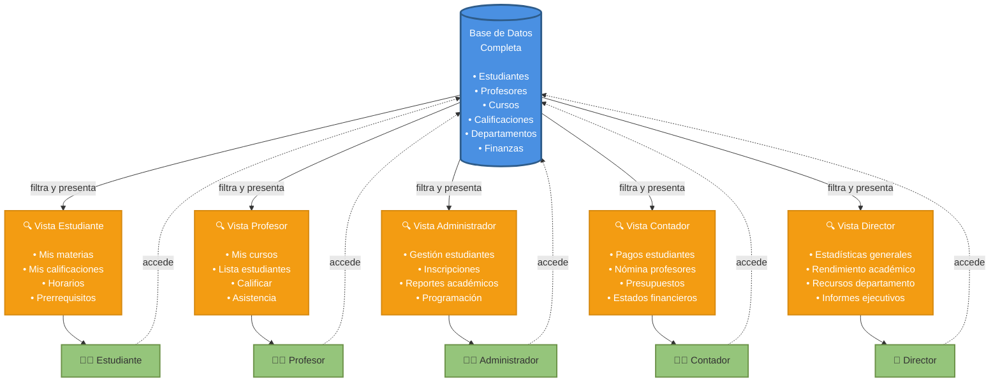

```mermaid
flowchart TB
    %% Base de datos central
    DB[(Base de Datos<br/>Completa<br/><br/>• Estudiantes<br/>• Profesores<br/>• Cursos<br/>• Calificaciones<br/>• Departamentos<br/>• Finanzas)]
    
    %% Diferentes tipos de usuarios
    EST[👨‍🎓 Estudiante]
    PROF[👨‍🏫 Profesor]
    ADMIN[👨‍💼 Administrador]
    CONT[👨‍💻 Contador]
    DIR[👤 Director]
    
    %% Vistas específicas para cada usuario
    VEST["🔍 Vista Estudiante<br/><br/>• Mis materias<br/>• Mis calificaciones<br/>• Horarios<br/>• Prerrequisitos"]
    
    VPROF["🔍 Vista Profesor<br/><br/>• Mis cursos<br/>• Lista estudiantes<br/>• Calificar<br/>• Asistencia"]
    
    VADMIN["🔍 Vista Administrador<br/><br/>• Gestión estudiantes<br/>• Inscripciones<br/>• Reportes académicos<br/>• Programación"]
    
    VCONT["🔍 Vista Contador<br/><br/>• Pagos estudiantes<br/>• Nómina profesores<br/>• Presupuestos<br/>• Estados financieros"]
    
    VDIR["🔍 Vista Director<br/><br/>• Estadísticas generales<br/>• Rendimiento académico<br/>• Recursos departamento<br/>• Informes ejecutivos"]
    
    %% Conexiones de usuarios a base de datos
    EST -.->|accede| DB
    PROF -.->|accede| DB
    ADMIN -.->|accede| DB
    CONT -.->|accede| DB
    DIR -.->|accede| DB
    
    %% Conexiones de base de datos a vistas
    DB -->|filtra y presenta| VEST
    DB -->|filtra y presenta| VPROF
    DB -->|filtra y presenta| VADMIN
    DB -->|filtra y presenta| VCONT
    DB -->|filtra y presenta| VDIR
    
    %% Conexiones de vistas a usuarios
    VEST --> EST
    VPROF --> PROF
    VADMIN --> ADMIN
    VCONT --> CONT
    VDIR --> DIR
    
    %% Estilos
    classDef database fill:#4a90e2,stroke:#2e5c8a,stroke-width:3px,color:#fff
    classDef user fill:#95c57b,stroke:#6b9147,stroke-width:2px,color:#333
    classDef view fill:#f39c12,stroke:#d68910,stroke-width:2px,color:#fff
    classDef connection stroke:#bdc3c7,stroke-width:2px,stroke-dasharray: 5 5
    
    class DB database
    class EST,PROF,ADMIN,CONT,DIR user
    class VEST,VPROF,VADMIN,VCONT,VDIR view
```