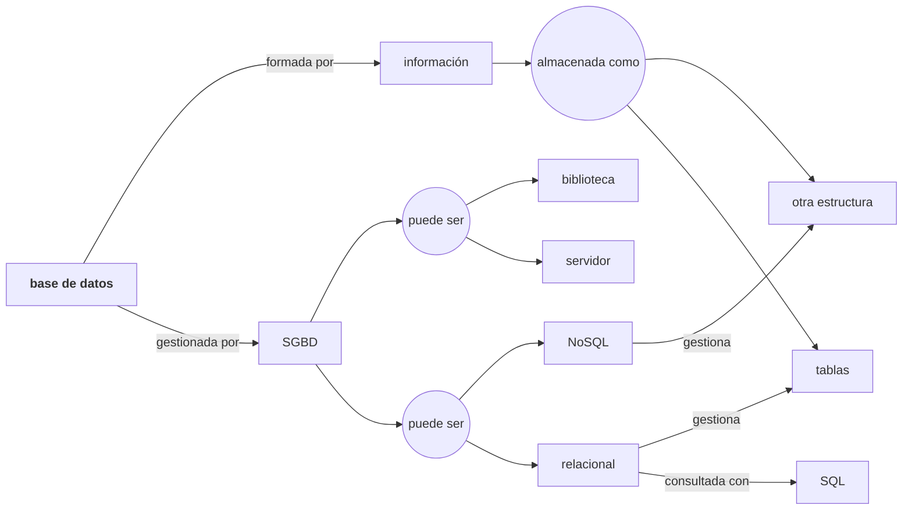

# LAB01 - Herramientas y primeras consultas de datos 

---

## Objetivos

Contenidos basados en [The Querynomicon: An Introduction to SQL for Weary Data Scientist](https://gvwilson.github.io/sql-tutorial/).

Los objetivos de aprendizaje de la sesión son:

- Entender el concepto de sistema gestor de bases de datos relacional
- Entender arquitectura cliente-servidor vs proceso único (librería)
- Instalar y manejar herramientas de trabajo con base de datos
- Escribir consultas SQL para seleccionar, filtrar y ordenar datos
- Realizar operaciones aritméticas
- Buscar patrones en cadenas de texto

---
## Conceptos básicos

- Una **base de datos** es una colección de datos que se pueden buscar y recuperar
- Un **sistema gestor de bases de datos** (DBMS) es un programa que gestiona un tipo particular de base de datos
- Cada DBMS almacena los datos a su manera
    - SQLite almacena cada base de datos en un único archivo
    - PostgreSQL distribuye la información en muchos archivos para un mayor rendimiento
- Un DBMS puede ser una **biblioteca integrada** en otros programas (SQLite) o un **servidor** (PostgreSQL, Oracle)
- Un **sistema gestor de bases de datos relacionales** (RDBMS) almacena los datos en **tablas** y utiliza **SQL** para las consultas
- Desafortunadamente, cada RDBMS tiene su propio **dialecto de SQL**

---
### SQL

Lenguaje de Consultas Estándar (Standard Query Language, ISO/IEC 9075)

Uno de los principales lenguajes de programación y el primero en ofertas de trabajo, según el informe “[The Top Programming Languages](https://spectrum.ieee.org/top-programming-languages-2024)” publicado anualmente por IEEE Spectrum.

- Es un lenguaje **declarativo**, el usuario especifica qué quiere, pero no cómo conseguirlo. Los lenguajes de programación suelen ser procedimentales.
- Se diseñó para que se leyese como inglés normal y fuese **fácil de usar**.
- Es un lenguaje **unificado**. Usado por todo tipo de usuarios, desde el administrador hasta el usuario final.

Especifica varios **sublenguajes**, entre otros:

- **Lenguaje de Definición de Datos** (LDD) para crear, modificar y borrar objetos de la base de datos (create, alter y drop).
- **Lenguaje de Manipulación de Datos** (LMD) para consultar y manipular los datos (select, insert, update y delete). En esta lección, solo consultaremos datos con select.

---

### Cliente-servidor vs Biblioteca


---

### Grafo de resumen



---
### SQLite

SQLite ([https://sqlite.org](https://sqlite.org)), diseñado por Richard Hipp, se lanzó por primera vez en el **2000**. 

A diferencia de MySQL y PostgreSQL, SQLite **no es un sistema cliente-servidor** en el que el servidor se ejecuta como un proceso independiente. 

SQLite es una **biblioteca de funciones en lenguaje C** que se pueden llamar directamente desde el código de la aplicación y **ejecutar en el proceso de la aplicación**. 

SQLite afirma ser el **sistema de base de datos más desplegado del mundo.** Está integrado (de manera invisible) en todos los teléfonos inteligentes Apple o Android; todos los ordenadores Mac o Windows; todos los navegadores Firefox, Chrome o Safari; y en innumerables aplicaciones conocidas. 

Por diseñar SQLite, Richard Hipp recibió el premio **SIGMOD Systems Award en 2017**.

---
## Herramientas

Para empezar necesitamos unas herramientas básicas:

- Un sistema gestor de bases de datos (SGBD): [SQLite](https://www.sqlite.org/download.html) (sqlite-tools-XXX.zip)
- Una herramienta de trabajo con bases de datos: [DBeaver](https://dbeaver.io/)
- Una base de datos de ejemplo:
    - Descargar script SQL desde [SQL snippets](https://i3lab.unex.es/sql-snippets/index.html?db=penguins):
        - Ejecutar script mediante herramienta de trabajo con bases de datos
    - La base de datos de pingüinos contiene dos tablas:
	    - penguins contiene toda la información de [Palmer Penguins](https://allisonhorst.github.io/palmerpenguins/)
	    - little_penguins es un subconjunto utilizado en las primeras consultas para mantener la legibilidad de la salida

>[!info]  SQL snippets: herramienta para las lecciones 
>Como alternativa más sencilla, podemos usar **[SQL snippets](https://i3lab.unex.es/sql-snippets/index.html?db=penguins)**. - pequeña aplicación web para la asignatura que contiene: el gestor (sqlite), un cliente web muy sencillo y todas las de bases de datos. Es la herramienta que usaremos siempre para los ejercicios.

---
### Tabla penguins

| species   | island    | bill_length_mm | bill_depth_mm | flipper_length_mm | body_mass_g | sex    |
| --------- | --------- | -------------- | ------------- | ----------------- | ----------- | ------ |
| Gentoo    | Biscoe    | 51.3           | 14.2          | 218.0             | 5300.0      | MALE   |
| Adelie    | Dream     | 35.7           | 18.0          | 202.0             | 3550.0      | FEMALE |
| Adelie    | Torgersen | 36.6           | 17.8          | 185.0             | 3700.0      | FEMALE |
| Chinstrap | Dream     | 55.8           | 19.8          | 207.0             | 4000.0      | MALE   |
| Adelie    | Dream     | 38.1           | 18.6          | 190.0             | 3700.0      | FEMALE |
| Adelie    | Dream     | 36.2           | 17.3          | 187.0             | 3300.0      | FEMALE |
| Adelie    | Dream     | 39.5           | 17.8          | 188.0             | 3300.0      | FEMALE |
| Gentoo    | Biscoe    | 42.6           | 13.7          | 213.0             | 4950.0      | FEMALE |
| Gentoo    | Biscoe    | 52.1           | 17.0          | 230.0             | 5550.0      | MALE   |
| Adelie    | Torgersen | 36.7           | 18.8          | 187.0             | 3800.0      | FEMALE |


Explicación del significado de las columnas
- `species`: especie del pingüino medido
- `island`: isla en la que se realizó la medición
- `bill_length_mm`: longitud del pico en mm
- `bill_depth_mm`: profundidad del pico en mm
- `body_mass_g`: peso del pingüino
- `sex`: sexo del pingüino


---

## La cláusula SELECT

---

### Seleccionar una constante

Código SQL:
```sql
select 1;
```
Salida:
```
1
```

- `select` es una **palabra clave de SQL**
- Normalmente se utiliza para **seleccionar datos de una tabla**…
- …pero si lo único que queremos es un valor constante, no necesitamos especificar una tabla
- Se requiere terminar la sentencia con un **punto y coma**

---
### Seleccionar todos los valores de una tabla

Código SQL:
```sql
select * 
from little_penguins;
```
Salida:

| species   | island    | bill_length_mm | bill_depth_mm | flipper_length_mm | body_mass_g | sex    |
| --------- | --------- | -------------- | ------------- | ----------------- | ----------- | ------ |
| Gentoo    | Biscoe    | 51.3           | 14.2          | 218.0             | 5300.0      | MALE   |
| Adelie    | Dream     | 35.7           | 18.0          | 202.0             | 3550.0      | FEMALE |
| Adelie    | Torgersen | 36.6           | 17.8          | 185.0             | 3700.0      | FEMALE |
| Chinstrap | Dream     | 55.8           | 19.8          | 207.0             | 4000.0      | MALE   |
| Adelie    | Dream     | 38.1           | 18.6          | 190.0             | 3700.0      | FEMALE |
| Adelie    | Dream     | 36.2           | 17.3          | 187.0             | 3300.0      | FEMALE |
| Adelie    | Dream     | 39.5           | 17.8          | 188.0             | 3300.0      | FEMALE |
| Gentoo    | Biscoe    | 42.6           | 13.7          | 213.0             | 4950.0      | FEMALE |
| Gentoo    | Biscoe    | 52.1           | 17.0          | 230.0             | 5550.0      | MALE   |
| Adelie    | Torgersen | 36.7           | 18.8          | 187.0             | 3800.0      | FEMALE |


- Ésta sí es una consulta de verdad
- Usa * para indicar “todas las columnas”
- Usa `from nombretabla` para especificar la tabla
- El **resultado** de una sentencia `SELECT` siempre es una **tabla**.

---

### Especificar columnas

Código SQL:
```sql
select
    species,
    island,
    sex
from little_penguins;
```
Salida:

|   species  |   island   |   sex   |
| ---------- | ---------- | ------- |
| Gentoo    | Biscoe    | MALE   |
| Adelie    | Dream     | FEMALE |
| Adelie    | Torgersen | FEMALE |
| Chinstrap | Dream     | MALE   |
| Adelie    | Dream     | FEMALE |
| Adelie    | Dream     | FEMALE |
| Adelie    | Dream     | FEMALE |
| Gentoo    | Biscoe    | FEMALE |
| Gentoo    | Biscoe    | MALE   |
| Adelie    | Torgersen | FEMALE |

- Especifica los nombres de las columnas separados por comas
    - En cualquier orden
    - Se permiten duplicados
- Se recomienda usar saltos de línea para facilitar la lectura

---

### Ordenar los resultados

Código SQL:
```sql
select
    species,
    sex,
    island
from little_penguins
order by island asc, sex desc;
```
Salida:

|  species  |  sex   |  island   |
|-----------|--------|-----------|
| Gentoo    | MALE   | Biscoe    |
| Gentoo    | MALE   | Biscoe    |
| Gentoo    | FEMALE | Biscoe    |
| Chinstrap | MALE   | Dream     |
| Adelie    | FEMALE | Dream     |
| Adelie    | FEMALE | Dream     |
| Adelie    | FEMALE | Dream     |
| Adelie    | FEMALE | Dream     |
| Adelie    | FEMALE | Torgersen |
| Adelie    | FEMALE | Torgersen |

- `order by` debe seguir a `from` (que debe seguir a `select`)
- `asc` es ascendente, `desc` es descendente
- El valor predeterminado es ascendente, pero es mejor especificarlo

---

### Ejercicio 1 - ORDER BY

Escribe una consulta SQL para seleccionar las columnas sex y body mass de little_penguins en ese orden, ordenadas de modo que la masa corporal más grande aparezca primero.


---

## Filtrando filas en el resultado

---

### Limitar número de filas del resultado


Código SQL:
```sql
-- La tabla penguins tiene 344 filas
select
    species,
    sex,
    island
from penguins
order by species asc, sex asc, island asc
limit 10;
```
Salida:

| species |  sex   |  island   |
|---------|--------|-----------|
| Adelie  |        | Dream     |
| Adelie  |        | Torgersen |
| Adelie  |        | Torgersen |
| Adelie  |        | Torgersen |
| Adelie  |        | Torgersen |
| Adelie  |        | Torgersen |
| Adelie  | FEMALE | Biscoe    |
| Adelie  | FEMALE | Biscoe    |
| Adelie  | FEMALE | Biscoe    |
| Adelie  | FEMALE | Biscoe    |

- Los **comentarios** comienzan con -- y continúan hasta el final de la línea
	- La tabla penguins contiene 344 filas
- `limit N` especifica el número máximo de filas devueltas por la consulta
- `limit` no pertenece al estándar SQL y en otros SGBD aparece de otra forma

---

### Offset en las filas del resultado

Código SQL:
```sql
select
    species,
    sex,
    island
from penguins
order by species asc, sex asc, island asc
limit 10 offset 3;
```
Salida:

| species |  sex   |  island   |
|---------|--------|-----------|
| Adelie  |        | Torgersen |
| Adelie  |        | Torgersen |
| Adelie  |        | Torgersen |
| Adelie  | FEMALE | Biscoe    |
| Adelie  | FEMALE | Biscoe    |
| Adelie  | FEMALE | Biscoe    |
| Adelie  | FEMALE | Biscoe    |
| Adelie  | FEMALE | Biscoe    |
| Adelie  | FEMALE | Biscoe    |
| Adelie  | FEMALE | Biscoe    |

- `offset N` debe seguir a `limit`
- Especifica la cantidad de filas que se omitirán desde el inicio de la selección
- Por lo tanto, esta consulta omite las primeras 3 y muestra las siguientes 10
- `offset` no pertenece al estándar SQL y en otros SGBD aparece de otra forma

---

### Eliminar duplicados

Código SQL:
```sql
select distinct
    species,
    sex,
    island
from penguins;
```
Salida:

|  species  |  sex   |  island   |
|-----------|--------|-----------|
| Adelie    | MALE   | Torgersen |
| Adelie    | FEMALE | Torgersen |
| Adelie    |        | Torgersen |
| Adelie    | FEMALE | Biscoe    |
| Adelie    | MALE   | Biscoe    |
| Adelie    | FEMALE | Dream     |
| Adelie    | MALE   | Dream     |
| Adelie    |        | Dream     |
| Chinstrap | FEMALE | Dream     |
| Chinstrap | MALE   | Dream     |
| Gentoo    | FEMALE | Biscoe    |
| Gentoo    | MALE   | Biscoe    |
| Gentoo    |        | Biscoe    |

- El **resultado** de una selección puede contener **filas duplicadas**
	- SQL usa el concepto de multiconjuntos o bolsas (multi-sets o bags): permiten elementos duplicados
	- Si no queremos duplicados en el resultado, hay que indicarlo explícitamente
- La palabra clave `distinct` debe aparecer justo después de `select`
    - Se supone que SQL se lee como el inglés
    - Lenguaje declarativo

---

### Ejercicio 2 - DISTINCT

Escribe una consulta para seleccionar las distintas combinaciones de islas (island) y especies (species) de la tabla penguins.

---

### Filtrar resultados con `where`

Código SQL:
```sql
select distinct
    species,
    sex,
    island
from penguins
where island = 'Biscoe';
```
Salida:

| species |  sex   | island |
|---------|--------|--------|
| Adelie  | FEMALE | Biscoe |
| Adelie  | MALE   | Biscoe |
| Gentoo  | FEMALE | Biscoe |
| Gentoo  | MALE   | Biscoe |
| Gentoo  |        | Biscoe |

- La cláusula `where condition` filtra las filas devueltas por la selección
- La **condición se evalúa de forma independiente para cada fila**
- Solo las filas que satisfacen la condición aparecen en los resultados
- Usa comillas simples para `‘datos de texto’` y comillas dobles para `"nombres de columna extraños"`
	- SQLite aceptará datos de texto entre comillas dobles, pero [SQLFluff](https://sqlfluff.com/) se quejará

---

### Ejercicio 3 - WHERE 

Escribe una consulta para seleccionar las masas corporales (body_mass_g) de los pingüinos (penguins) que pesen menos de 3000 gramos.

---

### Ejercicio 4 - WHERE 

Escribe otra consulta para seleccionar la especie (species) y el sexo (sex) de los pingüinos (penguins) que pesen menos de 3000 gramos. Esto demuestra que las columnas mostradas y las utilizadas en el filtrado son independientes entre sí.

---

### Múltiples condiciones de filtrado 

Código SQL:
```sql
select distinct
    species,
    sex,
    island
from penguins
where island = 'Biscoe' and sex != 'MALE';
```
Salida:

| species |  sex   | island |
|---------|--------|--------|
| Adelie  | FEMALE | Biscoe |
| Gentoo  | FEMALE | Biscoe |

- Operadores para las condiciones:
	- and: ambas subcondiciones deben ser verdaderas
	- or: una o ambas partes deben ser verdaderas
- Observa que la fila para pingüinos Gentoo en la isla Biscoe con sexo desconocido (vacío) no pasó el filtro
    - Hablaremos de esto más adelante

---

### Operadores de comparación 

| Operador | Descripción         |
| -------- | ------------------- |
| =        | Igual a             |
| >        | Mayor que           |
| <        | Menor que           |
| >=       | Mayor que o igual a |
| <=       | Menor que o igual a |
| <>       | No igual a          |
| !=       | No igual a          |

---

### Operadores booleanos

| Operador | Descripción                                                     |
| -------- | --------------------------------------------------------------- |
| AND      | Se evalúa a verdadero si ambas condiciones son verdaderas       |
| OR       | Se evalúa a verdadero si alguna de las condiciones es verdadera |
| NOT      | Cambia el resultado de la condición                             | 

---

### Ejercicio 5 - WHERE operadores

Utiliza el operador not para seleccionar pingüinos (solo las columnas species, sex, island) que no sean Gentoo.

---

### Ejercicio 6 - WHERE operador OR exclusivo

El operador `OR` de SQL es un operador ‘o inclusivo’: se ejecuta correctamente si una o ambas condiciones son verdaderas. SQL no proporciona un operador específico para el operador ‘o exclusivo’, que es verdadero si solo una de las condiciones es verdadera, pero se puede lograr el mismo efecto utilizando `AND`, `OR` y `NOT`. Escriba una consulta para seleccionar pingüinos (penguins) que sean hembras (female) o que estén en la isla (island) Torgersen, pero no ambos.

---

## Operaciones con columnas

Veamos ahora operaciones con columnas comunes:

- Operaciones aritméticas
- Renombrado
- Operaciones de texto

---

### Operaciones aritméticas

Código SQL:
```sql
select
    flipper_length_mm / 10.0,
    body_mass_g / 1000.0
from penguins
limit 3;
```
Salida:

| flipper_length_mm / 10.0 | body_mass_g / 1000.0 |
|--------------------------|----------------------|
| 18.1                     | 3.75                 |
| 18.6                     | 3.8                  |
| 19.5                     | 3.25                 |

- Se pueden realizar los tipos habituales de operaciones aritméticas con valores individuales
- El cálculo se realiza para cada fila de forma independiente
- El nombre de la columna muestra el cálculo

---

### Operadores aritméticos

| Operador | Descripción    |
| -------- | -------------- |
| +        | Suma           |
| -        | Resta          |
| *        | Multiplicación |
| /        | División       |
| %        | Módulo         |

---

### Funciones matemáticas

| Función    | Descripción                                                |
| ---------- | ---------------------------------------------------------- |
| Round(X)   | Redondea el número X su entero más cercano                 |
| Round(X,Y) | Redondea el número X a Y decimales                         |
| Ceil(X)  | Redondea el número hacia el entero inmediatamente superior |
| Floor(X) | Redondea el número hacia el entero inmediatamente inferior |
| Abs(X)     | Valor absoluto de X                                        |
| Sqrt(X)    | Raíz cuadrada de X                                         | 

---

### Renombrar columnas

Código SQL:
```sql
select
    flipper_length_mm / 10.0 as flipper_cm,
    body_mass_g / 1000.0 as weight_kg,
    island as where_found
from penguins
limit 3;
```
Salida:

| flipper_cm | weight_kg | where_found |
|------------|-----------|-------------|
| 18.1       | 3.75      | Torgersen   |
| 18.6       | 3.8       | Torgersen   |
| 19.5       | 3.25      | Torgersen   |

- Usa `expression as name` para cambiar el nombre de la columna resultado
- Usa un nombre significativo al resultado del cálculo
- También se puede cambiar el nombre de las columnas sin modificar: alias

---

### Ejercicio 7 - Operaciones aritméticas

Escribe una consulta que calcule y devuelva una columna llamada `bill_ratio` que tenga la relación entre la longitud del pico y la profundidad del mismo. Redonda el resultado para mostrar números con un solo decimal. Muestra solo las 10 primeras filas.

---

### Patrones de texto

Código SQL:
```sql
select distinct
    species,
    island 
from penguins
where species LIKE '%t%' AND island LIKE '_rea_';
```
Salida:

| species   | island |
| --------- | ------ |
| Chinstrap | Dream  |

- Usa el operador `LIKE` para buscar patrones en cadenas de texto
- Caracteres especiales para definir patrones:
	- _ reemplaza a cualquier carácter
	- % reemplaza a cualquier número de caracteres (incluido 0 caracteres)

---

### Funciones de texto

| Función         | Descripción                                                  |
| --------------- | ------------------------------------------------------------ |
| \|\|            | Operador de concatenación                                    |
| Length(X)       | Longitud de la cadena de texto X                             |
| Lower(X)        | Pasa a minúsculas todos las letras                           |
| Upper(X)        | Pasa a mayúsculas todos las letras                           |
| Initcap(X)      | Pasa todas las letras a minúscula y las primeras a mayúscula |
| substring(X, N) | Devuelve la subcadena de X a partir del caracter N           |
| Replace(X,Y,Z)  | Reemplaza la subcadena Y dentro de X por Z                   |
|                 |                                                              |

---

### Ejercicio 8 - Operador concatenación

Escribe una consulta que calcule y devuelva una columna llamada `what_where` que tenga la especie (`species`) y la isla (`island`) de cada pingüino separadas por un solo espacio.

---

## Fin de la lección

Enhorabuena has llegado al final de la sesión!

![[BD - Well done penguins.png]]

--- 